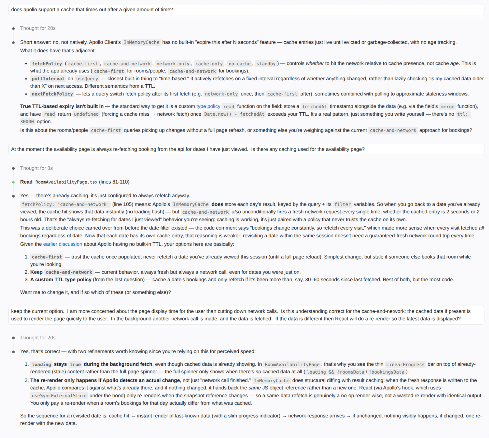
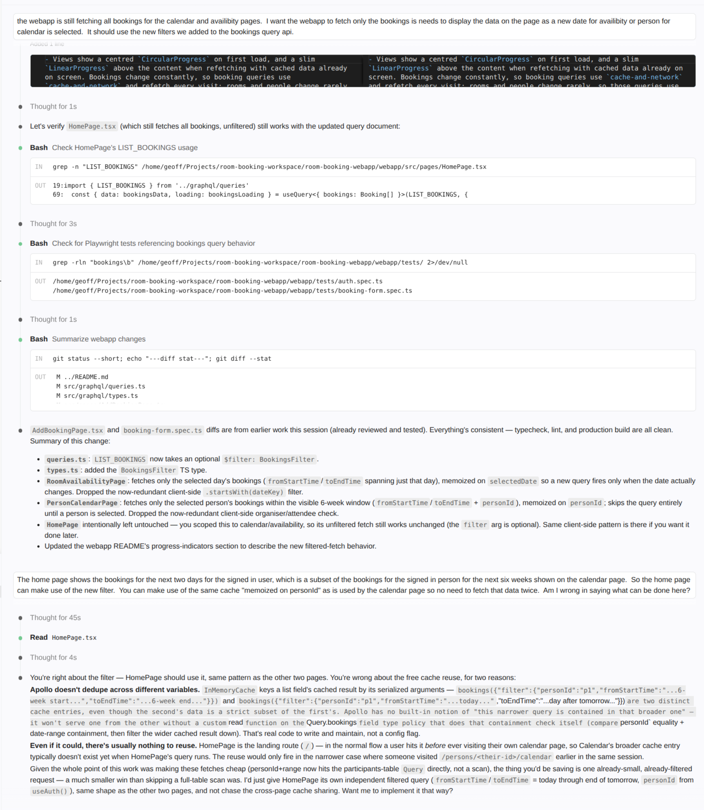
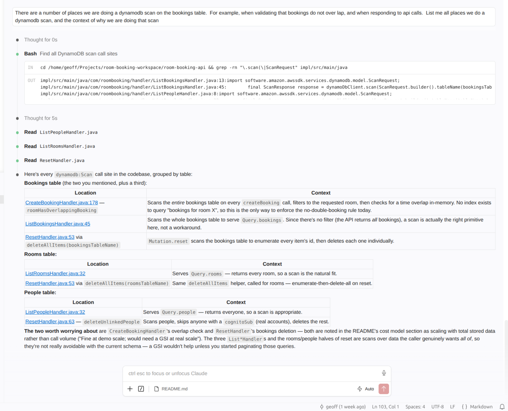

# mootmaker
✦ [Claude Code](https://claude.com/claude-code) exploration.

## Overview

The purpose of this learning project is to understand more about AI-assisted development.

I chose a technology stack that I have been working with commercially for a number of years, in which we have never used AI.  I aimed to learn about:
- the efficiency gains that can be had using AI.
- changes in development workflows when using AI.

I began this journey as a bit of an AI sceptic, only having had exposure to Microsoft Copilot, which I'd found next to useless.  I chose to try Claude Code as it had lots of hype, and other developers I knew were using it (and it was quite affordable).

## Projects

Projects built with Claude for this exploration:

- [mootmaker-api](https://github.com/geoffweatherall/mootmaker-api) - GraphQL API written using AppSync and Java Lambdas
- [mootmaker-webapp](https://github.com/geoffweatherall/mootmaker-webapp) - React SPA with Material Design
- [mootmaker-bootstrap-terraform](https://github.com/geoffweatherall/mootmaker-bootstrap-terraform) - Creates the shared S3 bucket used for Terraform remote state by the other projects
- [mootmaker-aws-account-bootstrap](https://github.com/geoffweatherall/mootmaker-aws-account-bootstrap) - CloudFormation locking down the AWS accounts the other projects deploy into: SCPs, IAM Identity Center (SSO) for keyless access, billing alerts, and access-key rotation
- [mootmaker-tools](https://github.com/geoffweatherall/mootmaker-tools) - Admin/support tools (e.g. a sample data generator) run locally against a deployed environment

## Learnings

#### Claude is excellent at generating code following existing patterns it sees in the code base and does not require detailed "coding standard" instructions in CLAUDE.md

My first steps were to see if routine and monotonous tasks — such as writing immutable Java classes with builders and full unit test coverage, including of the `.equals()` method, which requires a lot of test cases if the class has many attributes — could be handled well by Claude Code.  I wanted the code to follow a very specific coding style/standard.  

This was accomplished very quickly by Claude Code, and I did not need to give detailed instructions.  It was my first hint that Claude was not just a sophisticated pattern matching/templating tool.  


#### You can talk with Claude in the same language you'd use to talk to another developer who understands your code base well.  

Claude's comprehension is like a team member who understands all the terminology shortcuts that develop within a group of people working together for a long time.  When you say "The xxx" to Claude, it will work out what xxx is, as a human would.

This was another surprise for me that increased my estimation of how useful AI will be.

Claude was easily able to refactor domain models and their supporting unit tests.

#### Claude is really careful as it works.  

It runs tests to check the code it's written, and ad-hoc bash scripts to check deployments have been successful. Later on, when I developed a webapp, Claude was writing throwaway Playwright tests to verify specific changes it was making to the app, running them to check the change, and then deleting them when done.  Code is cheap.

Claude was also good at writing bash scripts.  It would check them by running them, and fix a few issues that showed up.  My _bash_ is "ok", but I learnt new tricks from seeing what Claude wrote.

You need to let Claude be agentic to get the most use out of it.  A heavily locked-down environment where Claude is only allowed to generate code would miss out on a lot of the efficiency gains possible.

#### It's not just about writing the code.  

Commercially I have used IntelliJ since Eclipse went extinct, but for this project I tried VS Code.  Claude was able to directly edit the VS Code configuration files and fix issues rather than being just a search engine making suggestions.

#### That beautiful code I can write by hand is not worth as much as it used to be, but I don't care as I can focus on higher-level tasks that add more value.

Throughout the days I've spent on this project, I've built and deployed more code than I could have done in weeks without using Claude.  The code that is written by Claude is still enhanceable and debuggable by a human.  The code is actually better than I've seen many developers write under the time pressure of deadlines.  

I think being a developer helps keep the code in a "good" state because you know what good looks like, and you can instruct Claude to write tests covering the sorts of things that typically go wrong.


#### Claude will make mistakes.  You need to be a good tester to be a good developer using AI.

A business rule I added to my project was that you could only book meetings that started and finished on 5-minute boundaries.  Claude initially used browser-native widgets as the time selector for these. When I tested this manually, I found I could select a meeting starting at 10:13am.  Claude thought it had a working solution.  I told Claude there was a bug, described the problem, told it to write a test covering the issue first, and then fix the issue.  Claude was able to work out what was wrong, and come up with a fix.


#### I should vibe more

Maybe the code base does not need to be treated as sacrosanct as when it was written by developers who expect other developers will need to enhance and bug fix it years from now.

I don't feel ready to totally abandon caring about the source code (i.e. care as little as I do about Java bytecode), but Claude makes keeping the code in pretty good shape nearly a free good.  So, no total vibe coding by a domain expert who has no understanding of software development.  But I think it's better to focus on the quality of the test cases (unit and acceptance), think about the overall direction of the project, and consider concerns like security.

#### You don't need to Google Stack Overflow

I can just ask Claude to do a number of tasks, e.g.
- I'm a terrible speller, just type out my best guesses and get Claude to correct the spelling for me
- I did not know the markdown for a list of checkboxes off the top of my head.  Rather than Googling it, I just ask Claude to add a sample into my document.

#### You don't run out of tokens easily

On the Claude Pro plan I can work as I would normally and not run out of tokens.  Even high-level tasks, like adding a new business rule that impacts both the API and the webapp, use only 5% of my half-daily allowance.  By the time I review the changes and manually test things, I'm consuming tokens at the rate I have them available.  I don't have a large code base with all sorts of obscured coupling in the code, but then, if you generate code with AI and follow good patterns, would you get into this mess anyway?

#### Claude is good at understanding the dependencies between projects

I can ask Claude to update my business model, and it will make changes to the GraphQL schema and related API code, and then make sensible changes to the webapp pages as well.  It understands that validation rules in the API impact the webapp, and that validation can be applied in only the API or both API and webapp.  It keeps the business-related logic in the two different projects in sync.  It would be good to see if this holds up across API-webapp-Android.

#### Claude is good at giving technical answers and providing options

It can give you estimated AWS costs for your project.  Much easier than using the AWS pages to calculate.  It can take costs into account when designing the code.  I instructed Claude that the project should "scale to zero" and it made choices on AWS components to use to meet this goal.  When it thought there was a slightly better option that would cost a small amount it offered me both options (e.g. in end-to-end acceptance tests the choice between using Cognito M2M auth vs a dummy user).

Example 1:


Example 2:



### Claude responds well to correction when it makes mistakes or oversights 




### When code is cheap you experiment more

Because it's much easier to change code as well as write code, I was encouraged to play around with different options more to see which I thought best (i.e. UI design).  There is much less need to spend a lot of time up front getting details sorted first.  You can make decisions later where they will be more informed by actual experiences rather than anticipated outcomes.  You can also leave things like performance improvements to later as refactoring is cheap(er).

### Use AI to explore your code base

Rather than manually reading a lot of code to collect the information you need to make decisions, you can get AI to do analysis for you, and then use that to consider your next step.



### Impacts on the test pyramid

Thinking about the impacts on the [test pyramid](https://martinfowler.com/articles/practical-test-pyramid.html) if the cost of writing code (and tests) is much cheaper.

Arguments for "no change":

- The execution time of the test is still a force pushing towards the test pyramid.
- Cheaper is not free.  You will still need to review test cases and code.

What becomes the primary source definition for what the tests need to cover, particularly e2e tests?  Should you focus on a good set of definitions here (BDD) or longer form text, and use these to update the actual e2e test code?

### A new way to learn

Claude is not like a junior software engineer, it's like a very senior software engineer.  You can learn a new area of technology by using Claude to build an example, and asking Claude to explain what it's done and why.  This might be more powerful than following a tutorial you find on the internet.


## To Do

Unordered.

### Technical

- [ ] Move webapp config (API URL) from build time to deploy time to page load time.
- [x] API to check for null and missing
- [x] Deploy test and production environments.  Needed before domain purchase.
- [ ] Project to support domain, Route53.
- [x] Project to support Terraform remote state resources
- [x] Add authentication with Cognito
- [ ] Have new users automatically set up as a Person
- [x] Add a bootstrap project for Terraform resources
- [ ] Buy a domain and link it to the prod environment, terraform Route53
- [ ] Free tier WAF if possible
- [ ] Make DynamoDB more efficient - use indexes rather than table scans
- [ ] Reset button appears in the UI for environments that support it.  Share environment config between the API and the webapp
- [ ] In a non-prod environment, have a button to first reset and then add useful sample data
- [ ] Add DynamoDB GSIs to replace current table scans with more efficient query operations.
- [ ] (Maybe) add unit tests in the webapp.  Useful if humans will do development, but maybe less so if everything remains vibed?

And what would happen if I just told Claude to do this whole list?

### Business Functionality

- [ ] Support recurring meetings (e.g. a weekly standup)
- [ ] Find a room in a schedule, even when some of the room's time slots are already booked
- [ ] User usage metrics
- [ ] Have a "find a room" page, which has a list of attendees and finds the smallest available room within a given time window, which might be larger than the length of the meeting
- [x] User sign up
- [ ] Continue with Google
- [x] Password reset, both send reset code and then enter reset code
- [ ] Close user account
- [ ] Calendar view per Person
- [ ] Calendar view per Room
- [ ] Cancel meeting option
- [ ] Use Claude to generate an icon and a custom colour scheme, and use some Material Design icons to make the webapp look better
- [ ] An Android app.  Super vibe this.  Once the webapp is quite mature, tell it to make a native Android app with the same look and feel and same business functionality, but idiomatically an Android app in convention and design. 
- [ ] Ask Claude to make business functionality suggestions to improve the project.

## Multi-environment deployments

### Overview

Multiple independent copies of the stack (API + webapp) can run in the same AWS account at once, each identified by an arbitrary **environment** name — `test`, `production`, or a developer's own name for a personal sandbox (e.g. `bob`). There's no fixed list of environments to register anywhere; the name is just an argument passed to each project's scripts. Every environment gets:

- its own Terraform state, held in the shared bucket created by [mootmaker-bootstrap-terraform](https://github.com/geoffweatherall/mootmaker-bootstrap-terraform), and
- its own uniquely-named AWS resources (Lambdas, DynamoDB tables, Cognito user pool, S3 bucket, CloudFront distribution, etc.),

so environments can be created and destroyed independently without touching each other.

### Tricky issues and how they're solved

- **AWS resource names would collide across environments.** Every resource name used to derive from a single `project_name` variable, which is fine with one deployment but would clash the moment `test` and `production` (or `bob`) tried to create identically-named Lambdas/tables/etc. in the same account. Fix: each project computes a `resource_prefix = "<environment>-<project_name>"` local and names every resource from that instead.
- **Terraform state needs to be per-environment, in one shared bucket.** The state key now includes the environment: `<environment>/<project-name>/terraform.tfstate` (e.g. `test/mootmaker-api/terraform.tfstate`). The bucket/region/locking config stays static in a checked-in `backend.hcl`, but the `key` is supplied at `terraform init` time by each script, computed from the environment argument — so any environment name works without editing any file.
- **Switching environments in the same checkout could corrupt Terraform's local cache.** Terraform records which backend it's configured for in a local `.terraform/` directory; reusing that between environments (or running two environments concurrently from one checkout) risked one clobbering the other's cached config. Fix: each script sets `TF_DATA_DIR` to a per-environment directory (`.terraform-<environment>/`), so each environment's local metadata is fully isolated.
- **The webapp needs values (Cognito ids, GraphQL URL) from the API's deployment, per environment.** `authenticate.sh` now takes the environment name as an argument and re-initialises itself against that environment's state before reading outputs, so it always reads the right environment's values. The webapp's `deploy.sh` takes the same environment name and passes it straight through to `authenticate.sh`, so an API and webapp deployed with the same environment name are automatically wired together.
- **Accidentally deploying to the wrong place.** There's no default environment — every script requires the name to be passed explicitly, and validates it against a safe character set (lowercase letters, digits, hyphens) since it ends up embedded in AWS resource names and S3 state keys. `undeploy.sh` also still requires interactive confirmation (no `-auto-approve`), regardless of environment.

## Overall How-to: set up, test, and tear down your own environment

Prerequisites: the shared state bucket already exists (one-time setup, see [mootmaker-bootstrap-terraform](https://github.com/geoffweatherall/mootmaker-bootstrap-terraform)'s README), and you have `mootmaker-api` and `mootmaker-webapp` checked out as sibling directories.

Pick a name nobody else is using — your own name works well (this example uses `bob`):

```bash
# 1. Deploy the API
cd mootmaker-api
./deploy.sh bob

# 2. Try it out / run the acceptance tests against your environment
./verify.sh bob

# 3. Deploy the webapp, pointed at the same environment's API
cd ../mootmaker-webapp
./deploy.sh bob
# prints a site URL - open it and try the app for real

# 4. When you're done, tear both down (order doesn't matter)
./undeploy.sh bob
cd ../mootmaker-api
./undeploy.sh bob
```

Each `./deploy.sh`/`./undeploy.sh` prompts you through anything it needs (AWS credentials, a sibling API checkout, etc.) and fails fast with a clear message if a prerequisite is missing. Since `bob` gets entirely separate AWS resources and Terraform state from `test`/`production`, you can iterate freely without any risk of touching a shared environment.

