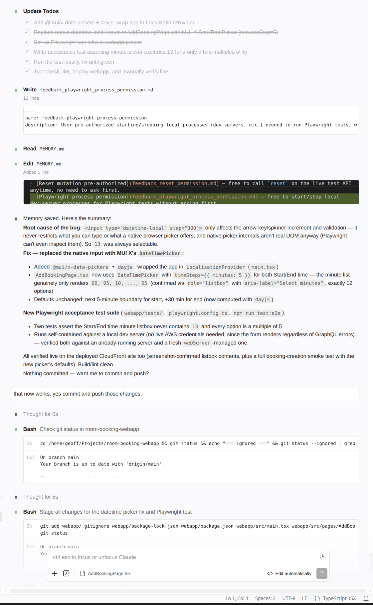

# room-booking
✦ [Claude Code](https://claude.com/claude-code) exploration.

## Overview

The purpose of this learning project is to understand more about AI assisted development.

I chose a technology stack that I have been working with commercially for a number of years, in which we have never used AI.  I aimed to learn about:
- the efficiency gains that could be gained using AI
- changes in daily workflows that occur when using AI.

I began this journey as a bit of an AI sceptic, only having had exposure to Microsoft Copilot, which I'd found next to useless.  I chose to try Claude Code as it had lots of hype, and other developers I knew were using it (and it was quite affordable).

## Projects

Projects built with Claude for this exploration:

- [room-booking-api](../room-booking-api) - GraphQL API written using AppSync and Java Lambdas
- [room-booking-webapp](../room-booking-webapp) - React SPA with Material Design
 

## Learnings

#### Claude is excellent at generating code following existing patterns it sees in the code base and does not require detailed "coding standard" instructions in CLAUDE.md

My first steps were to see if routine and monotonous tasks — such as writing immutable Java classes with builders and full unit test coverage, including of the `.equals()` method, which requires a lot of test cases if the class has many attributes — could be handled well by Claude Code.  I wanted the code to follow a very specific coding style/standard.  

This was accomplished very quickly by Claude Code, and I did not need to give detailed instructions.  It was my first hint that Claude was not just a sophisticated pattern matching/templating tool.  

#### You can talk with Claude in the same language you'd use to talk to another developer who understands your code base well.  

Claude's comprehension is like a team member who understands all the terminology shortcuts that develop within a group of people working together for a long time.  When you say "The xxx" to Claude, it will work out what xxx is, as a human would.

This was another surprise for me that increased my estimation of how useful AI will be.

Claude was easily able to refactor domain models and their supporting unit tests with ease.

#### Claude is really careful as it works.  

It runs tests to check the code it's written, and ad-hoc bash scripts to check deployments have been successful. Later on, when I developed a webapp, Claude was writing throwaway Playwright tests to verify specific changes it was making to the app, running them to check the change, and then deleting them when done.  Code is cheap.

Claude was also good at writing bash scripts.  It would check them by running them, and fix a few issues that showed up.  My _bash_ is "ok", but I learnt new tricks seeing what Claude wrote.

You need to let Claude be agentic to get the most use out of it.  A heavily locked-down environment where Claude is only allowed to generate code would miss out on a lot of the efficiency gains possible.

#### It's not just about writing the code.  

Commercially I have used IntelliJ since Eclipse went extinct, but for this project I tried VS Code.  Claude was able to directly edit the VS Code configuration files and fix issues rather than being just a search engine making suggestions.

#### That beautiful code I can write by hand is not worth as much as it used to be, but I don't care as I can focus on higher-level tasks that add more value.

Throughout the days I've spent on this project, I've built and deployed more code than I could have done in weeks without using Claude.  The code that is written by Claude is still enhanceable and debuggable by a human.  The code is actually better than I've seen many developers write under the time pressure of deadlines.  

I think being a developer helps keep the code in a "good" state because you know what good looks like, and you can instruct Claude to write tests covering the sorts of things that typically go wrong.

#### Claude will make mistakes.  You need to be a good tester to be a good developer using AI.

A business rule I added to my project was that you could only book meetings that started and finished on 5-minute boundaries.  Claude initially used browser-native widgets for a time selector for these. When I tested this manually, I found I could select a meeting starting at 10:13am.  Claude thought it had a working solution.  I told Claude there was a bug, described the problem, told it to write a test covering the issue first, and then fix the issue.  Claude was able to work out what was wrong, and come up with a fix.

#### I should vibe more

Maybe the code base does not need to be treated as sacrosanct as when it was written by developers who expect other developers will need to enhance and bug fix it years from now.

I don't feel ready to totally abandon caring about the source code (i.e. care as little as I do about Java bytecode), but Claude makes keeping the code in pretty good shape nearly a free good.  So, no total vibe coding by a domain expert who has no understanding of software development.  But I think it's better to focus on the quality of the test cases (unit and acceptance), think about the overall direction of the project, and consider concerns like security.

#### You don't need to Google Stack Overflow

I can just ask Claude to do a number of tasks, e.g.
- I'm a terrible speller, just type out my best guesses and get Claude to correct the spelling for me
- I did not know the markdown for a list of checkboxes off the top of my head.  Rather than googling it, I just ask Claude to add a sample into my document.

#### You don't run out of tokens easily

On the Claude pro plan I can work as I would normally and not run out of tokens.  Even high-level tasks, like adding a new business rule that impacts both the API and the webapp, use only 5% of my half-daily allowance.  By the time I review the changes and manually test things, I'm consuming tokens at the rate I have them available.  I don't have a large code base with all sorts of obscured coupling in the code, but then if you generate code with AI and follow good patterns would you get into this mess anyway?

#### Claude is good at understanding the dependencies between projects

I can ask Claude to update my business model, and it will make changes to the GraphQL schema and related API changes, and then sensible changes to the webapp pages as well.  It understands that validation rules in the API impact the webapp, and that validation can be applied in only the API or both API and webapp.  It keeps the business-related logic in the two different projects in sync.  It would be good to see if this holds up across API-webapp-Android.

## To Do

Unordered.

### Technical

- [ ] Move webapp config (api url) from build time to deploy time to page load time.
- [x] API to check for null and missing
- [ ] Deploy test and production environments.  
- [ ] Make production deployment configurable to remove the reset API for that env
- [ ] Add authentication with Cognito
- [ ] Have new users automatically set up as a Person
- [ ] Add a bootstrap project for Terraform resources
- [ ] Buy a domain and link it to the prod environment, terraform Route53
- [ ] Free tier WAF if possible
- [ ] Make DynamoDB more efficient - use indexes rather than table scans
- [ ] Reset button appears in the UI for environments that support it.  Share environment config between the API and the webapp
- [ ] In a non-prod environment, have a button to first reset and then add useful sample data

And what would happen if I just told Claude to do this whole list?

### Business Functionality

- [ ] Support recurring bookings (e.g. a weekly standup) with some of the time slots for rooms already booked, find a room in a schedule
- [ ] User usage metrics
- [ ] Have a "find a room" page, which has a list of attendees and finds the smallest available room within a given time window, which might be larger than the length of the meeting
- [ ] User sign up
- [ ] Continue with Google
- [ ] Password reset, both send reset code and then enter reset code
- [ ] Close user account
- [ ] Calendar view per Person
- [ ] Calendar view per Room
- [ ] Cancel booking option
- [ ] Use Claude to generate an icon, custom colour scheme, use some Material Design icons to make the webapp look better
- [ ] An Android app.  Super vibe this.  Once the webapp is quite mature, tell it to make a native Android app with the same look and feel and same business functionality, but idiomatically an Android app in convention and design. 
- [ ] Ask Claude to make business functionalty suggestions to improve by project.
